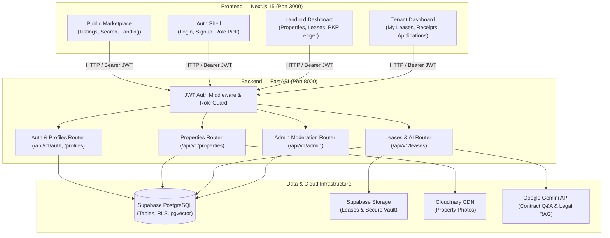

# Rentillect 🏢🇵🇰

<div align="center">


<br/>

**Intelligent Property Rental Management Platform Tailored for Pakistan**

[](https://nextjs.org/)
[](https://fastapi.tiangolo.com/)
[](https://python.org/)
[](https://www.typescriptlang.org/)
[](https://supabase.com/)
[](https://tailwindcss.com/)
[](https://aistudio.google.com/)

[Overview](#-overview) • [Tech Stack](#-technology-stack) • [Architecture](#-architecture) • [Roadmap Status](#-development-roadmap) • [Quick Start](#-quick-start) • [API Reference](#-api-endpoints-phase-1)

</div>

---

## 🌟 Overview

Rentillect bridges the trust and legal deficit in the Pakistani rental real estate market. Traditional leasing in Pakistan suffers from verbal ambiguities, informal cash receipts, identity impersonation, and non-compliance with provincial tenancy laws. 

Rentillect introduces a digital-first, legally-grounded platform supporting:
* **Dual-Role Accounts**: A single user account can simultaneously act as a **Landlord** (listing properties) and a **Tenant** (renting homes) with instant 1-click mode switching.
* **100% Pakistani Rupee (PKR) Financials**: Transparent rent schedules, security deposit logging, and automated digital receipts.
* **National Identity (CNIC) Verification**: Verification workflows formatted for Pakistani 13-digit CNICs (`37405-xxxxxxx-x`).
* **Provincial Tenancy Act Legal RAG**: AI-driven contract analysis adhering to the *Punjab Rented Premises Act 2009*, *Sindh Rented Premises Ordinance 1979*, and *Islamabad Rent Restriction Ordinance 2001*.
* **Pakistan Geographic Coverage**: Pre-seeded database of 8 major cities (Islamabad, Rawalpindi, Lahore, Karachi, Peshawar, Quetta, Faisalabad, Multan) and their key residential sectors/societies (F-10, E-11, DHA, Bahria Town, Gulberg, Clifton).

---

## 🛠 Technology Stack

### Core Frameworks & Runtime

| Layer | Technology | Version | Purpose |
|---|---|---|---|
| **Frontend** | **Next.js** (App Router) | `15.2.0` | Server & Client Components, Dynamic Routing, Fast Rendering |
| **Language** | **TypeScript** | `^5.7.3` | End-to-end type safety across domain interfaces |
| **Styling** | **Tailwind CSS** | `^3.4.17` | Curated Emerald Green (`#059669`) & Deep Slate design system |
| **State** | **Zustand** | `^5.0.3` | Persistent authentication and active dual-role session store |
| **Backend API** | **FastAPI** | `^0.115.0` | High-performance Python backend with Pydantic validation |
| **Python Runtime** | **Python** | `3.12.3` | ASGI server runtime via Uvicorn |
| **Database** | **Supabase PostgreSQL** | `15+` | Relational storage with Row-Level Security (RLS) & `pgvector` |
| **Authentication** | **Supabase Auth + JWT** | — | Bearer token issuance, HS256 JWT validation |
| **File Storage** | **Supabase Storage** | — | Private buckets for leases, CNIC documents, and notices |
| **Media Hosting** | **Cloudinary** | `^1.41.0` | CDN image storage & automated WebP transformations |
| **Maps** | **Leaflet & OpenStreetMap** | `^1.9.4` | Open-source interactive map pin placement and search |
| **AI / Legal LLM** | **Google Gemini Flash** | — | Direct contract summarization & provincial statute RAG |

---

## 🏛 System Architecture

FastAPI acts as the central business logic controller, while Next.js handles the presentation layer:



---

## 🗺 Development Roadmap

| Phase | Module | Status | Highlights |
|---|---|:---:|---|
| **Phase 0** | **Scaffolding & Infrastructure** | **COMPLETE** | Monorepo layout, Next.js 15, FastAPI, PostgreSQL initial schemas & seed data. |
| **Phase 1** | **User & Role Management** | **COMPLETE** | Supabase Auth, Dual-Role accounts (Landlord + Tenant), CNIC formatting, profile management, and role-based dashboard shells. |
| **Phase 2** | **Property Listings, Maps & Photos** | **COMPLETE** | Public search & split-view marketplace, Leaflet.js interactive maps & pin drop, PKR pricing, Cloudinary photo uploads, and 3-step listing creation wizard. |
| **Phase 3** | **Tenant Screening & CNIC Verification** | *Planned* | Rental applications, income proofs, and AI-assisted CNIC document checks. |
| **Phase 4** | **Smart Lease Assistant & Provincial RAG** | *Planned* | Direct Gemini PDF contract analysis, Punjab/Sindh/ICT tenancy act comparison. |
| **Phase 5** | **Rent Payments & Digital Receipts** | *Planned* | Monthly PKR rent payment ledger, status tracking, and printable receipts. |
| **Phase 6** | **Real-Time Chat & In-App Alerts** | *Planned* | Supabase Realtime 1-on-1 messaging between landlord and tenant. |
| **Phase 7** | **Admin Panel & Property Handover** | *Planned* | Platform moderation, ownership transfer requests, and audit logging. |

---

## 🔑 Phase 1 Highlights: Dual-Role Architecture

In Rentillect, users are not restricted to a single persona:
* A landlord can also be a tenant renting a portion in another city.
* A tenant can list their family-owned house as a landlord.
* Switching modes is instant via the **RoleSwitcher** top-bar component, maintaining separate workflows while sharing profile information.

```
User (Single Auth Account)
 ├── Active Role: Landlord ➔ /landlord (Properties, Revenue, Leases)
 └── Active Role: Tenant   ➔ /tenant   (Active Rent, Due Dates, Applications)
```

---

## 🗺️ Phase 2 Highlights: Property Listings, Leaflet Maps & Cloudinary

Phase 2 brings full residential property management tailored specifically for the Pakistani rental market:

### 1. Interactive Leaflet & OpenStreetMap Explorer
* **Marketplace Browse Mode**: Multi-marker map with custom Jet Black & Emerald price badges (e.g., `₨ 85k`, `₨ 1.4 Lac`). Clicking pins pops up property cards with direct links.
* **Draggable Pin-Drop Mode**: Landlords can click anywhere in Pakistan or drag a marker to set pinpoint geographic coordinates for their listings.

### 2. Public Marketplace Split-View (`/properties`)
* **Dynamic Pakistani Filters**: Filter by City (Islamabad, Lahore, Karachi, Rawalpindi, etc.), Area/Sector, Property Type (House, Apartment, Portion, Room), PKR rent range, Bedrooms, and Furnishing.
* **Responsive Split View**: Left side features responsive cards with Cloudinary photo previews; right side features sticky Leaflet map explorer.
* **Mobile-Optimized**: Toggle between List and Map views on mobile devices.

### 3. Comprehensive Property Detail Page (`/properties/[id]`)
* **Interactive Photo Gallery**: Cloudinary multi-photo viewer.
* **PKR Rent Breakdown**: Monthly rent, refundable security deposit, and lease term standards.
* **Pakistani Amenities**: Badges for 24/7 Backup Generator/UPS, Sui Gas connection, Sweet Water / Boring, 24/7 Gated Security, and Dedicated Parking.
* **Verified Landlord Direct Connect**: One-click WhatsApp message and direct calling links with masked privacy.

### 4. 3-Step Landlord Listing Creation Wizard (`/landlord/properties/new`)
* **Step 1: Details & PKR Pricing**: Specs, rent, security deposit, and description.
* **Step 2: Pakistani Location & Pin Drop**: City/area selectors with interactive map coordinate picker.
* **Step 3: Cloudinary Photos & Utilities**: Multi-file upload with cover photo selection and utility checklist.

---

## 📡 API Endpoints Reference

All endpoints are prefixed with `/api/v1` and accessible via Swagger at `http://localhost:8000/docs`:

### Properties & Geographic Data (Phase 2)
* `GET /properties/cities` — Retrieve all 8 pre-seeded Pakistani cities.
* `GET /properties/cities/{city_id}/areas` — Fetch all residential sectors/societies for a given city.
* `GET /properties` — Public marketplace search with multi-parameter filtering (city, area, type, min/max rent, bedrooms, furnished).
* `GET /properties/mine` — *(Landlord Only)* Retrieve all listings owned by the authenticated landlord.
* `POST /properties` — *(Landlord Only)* Create a new property listing with amenities and coordinates.
* `GET /properties/{property_id}` — Public endpoint retrieving complete property details, photos, and landlord contact.
* `PATCH /properties/{property_id}` — *(Landlord Only)* Update details of an existing listing.
* `DELETE /properties/{property_id}` — *(Landlord Only)* Delist a property.
* `POST /properties/{property_id}/images` — *(Landlord Only)* Upload property photo directly to Cloudinary CDN and attach to listing.
* `DELETE /properties/{property_id}/images/{image_id}` — *(Landlord Only)* Delete image from Cloudinary and listing.

### Authentication & Profiles (Phase 1)
* `POST /auth/signup` — Register new user with auto-confirmation, profile creation, and initial role (`landlord` or `tenant`).
* `POST /auth/login` — Authenticate with email/password and obtain Bearer JWT.
* `GET /auth/me` — Retrieve authenticated user profile and all assigned roles.
* `GET /profiles/me` — Full user profile details.
* `PATCH /profiles/me` — Update full name, Pakistani mobile number, city, address, or CNIC.
* `POST /profiles/me/roles` — Activate a second role (e.g., Tenant adding Landlord mode).
* `GET /profiles/{user_id}` — Public profile with privacy protection (masks phone and CNIC).

### Administration & Health
* `GET /health` — Verifies API health and live Supabase PostgreSQL connectivity.
* `GET /admin/users` — *(Admin Only)* Paginated list of platform users and assigned roles.
* `PATCH /admin/users/{user_id}/status` — *(Admin Only)* Suspend or reinstate user accounts.

---

## 🚀 Quick Start

### Prerequisites
* **Node.js** `v20+` or `v24+` & **npm**
* **Python** `3.12+`
* **Supabase** Account (Free tier)
* **Cloudinary** Account (Free tier)

---

### 1. Database Setup (Supabase)
1. Create a new project at [supabase.com](https://supabase.com).
2. Enable the **`vector`** extension in Database $\rightarrow$ Extensions.
3. Open the **SQL Editor** in Supabase and run the migration scripts in order:
   * [database/migrations/001_initial_schema.sql](file:///d:/Rentillect/database/migrations/001_initial_schema.sql) *(Core tables, enums, constraints)*
   * [database/seeds/001_pakistan_cities_areas.sql](file:///d:/Rentillect/database/seeds/001_pakistan_cities_areas.sql) *(Pakistani cities & sectors)*
   * [database/migrations/002_grant_permissions.sql](file:///d:/Rentillect/database/migrations/002_grant_permissions.sql) *(PostgREST role grants)*
   * [database/migrations/003_rls_policies.sql](file:///d:/Rentillect/database/migrations/003_rls_policies.sql) *(Row-Level Security policies)*

---

### 2. Backend Setup (FastAPI)

```bash
cd backend

# Create & activate virtual environment
python -m venv .venv
# On Windows:
.venv\Scripts\activate
# On Linux/macOS:
# source .venv/bin/activate

# Install dependencies
pip install -r requirements.txt

# Configure environment credentials
cp .env.example .env
# Edit .env with your Supabase, Cloudinary, and Gemini keys

# Launch backend server
uvicorn app.main:app --reload --port 8000
```
* **API Root:** [http://localhost:8000](http://localhost:8000)
* **Swagger Documentation:** [http://localhost:8000/docs](http://localhost:8000/docs)
* **Health Check:** [http://localhost:8000/api/v1/health](http://localhost:8000/api/v1/health)

---

### 3. Frontend Setup (Next.js 15)

```bash
cd frontend

# Install dependencies
npm install

# Configure environment credentials
cp .env.example .env.local

# Launch Next.js dev server
npm run dev -- -p 3000
```
* **Web Application:** [http://localhost:3000](http://localhost:3000)
* **Sign Up:** [http://localhost:3000/signup](http://localhost:3000/signup)
* **Log In:** [http://localhost:3000/login](http://localhost:3000/login)

---

## 📄 License & Legal Notice

This project is licensed under the MIT License. 

*Legal Disclaimer: Rentillect provides rental management software and informational statutory context. It does not provide formal legal counsel or replace official government registration procedures.*
