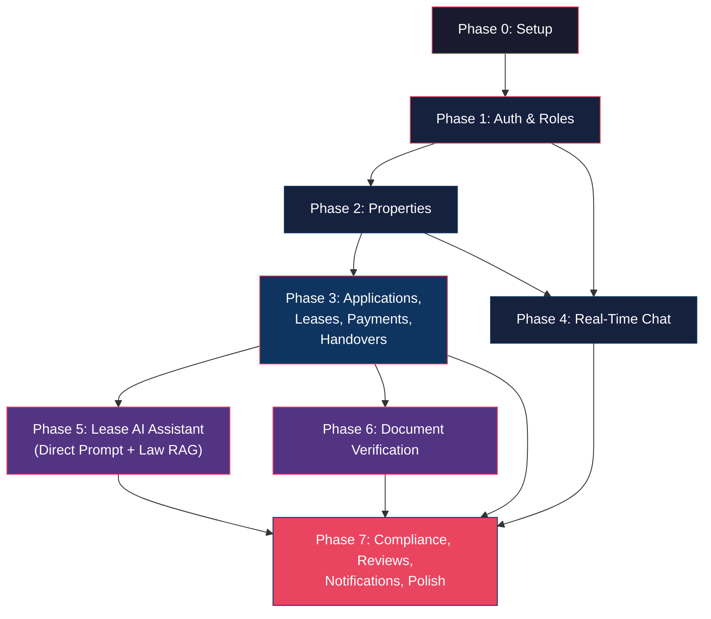

# Implementation Plan — Rental Management Platform

> [!NOTE]
> This plan is ordered by **dependency**. Each phase builds on the previous one. Complete phases in order — do not skip ahead.

---

## Phase 0: Project Scaffolding & Infrastructure

**Goal:** Set up the monorepo, connect all services, and verify they talk to each other.

### 0.1 Supabase Setup

- Create a new Supabase project
- Enable the **pgvector** extension (Dashboard → Database → Extensions)
- Note down: `SUPABASE_URL`, `SUPABASE_ANON_KEY`, `SUPABASE_SERVICE_ROLE_KEY`, `DATABASE_URL`
- Create Supabase Storage buckets:
  - `leases` (private)
  - `documents` (private)
  - `secure-vault` (private)
  - `chat-attachments` (private)
  - `notices` (private)

### 0.2 Cloudinary Setup

- Create a free Cloudinary account
- Note down: `CLOUDINARY_CLOUD_NAME`, `CLOUDINARY_API_KEY`, `CLOUDINARY_API_SECRET`
- Create an upload preset for property images (unsigned, auto-transform to webp)

### 0.3 Next.js 15 Frontend

```
project-root/
├── frontend/        ← Next.js 15 (App Router)
├── backend/         ← FastAPI
└── database/        ← SQL migration files
```

- Initialize Next.js 15 with App Router, TypeScript, ESLint
- Install dependencies:
  - `@supabase/supabase-js` (auth + realtime)
  - `leaflet` + `react-leaflet` (maps)
  - `cloudinary` (image upload)
  - `react-markdown` (rendering AI responses)
  - `zustand` (state management — lightweight, no boilerplate)
  - A UI component library — **shadcn/ui** (recommended: free, composable, works with Next.js App Router)
- Set up folder structure:
  ```
  frontend/src/
  ├── app/
  │   ├── (public)/           ← publicly accessible routes
  │   │   ├── page.tsx        ← landing/home
  │   │   ├── properties/     ← public listings
  │   │   └── login/
  │   ├── (dashboard)/        ← authenticated routes
  │   │   ├── layout.tsx      ← sidebar + role-based nav
  │   │   ├── landlord/
  │   │   ├── tenant/
  │   │   └── admin/
  │   └── layout.tsx          ← root layout
  ├── components/
  │   ├── ui/                 ← shadcn components
  │   ├── layout/             ← Sidebar, Navbar, etc.
  │   └── shared/             ← reusable across roles
  ├── lib/
  │   ├── supabase.ts         ← Supabase client init
  │   ├── api.ts              ← FastAPI client (fetch wrapper)
  │   └── utils.ts
  ├── stores/                 ← Zustand stores
  └── types/                  ← TypeScript interfaces
  ```

### 0.4 FastAPI Backend

- Initialize with `poetry` or `pip` + `requirements.txt`
- Install dependencies:
  - `fastapi`, `uvicorn`
  - `supabase` (Python client — for service-role DB access)
  - `python-jose` (JWT verification)
  - `python-multipart` (file uploads)
  - `pydantic` (request/response models)
  - `cloudinary` (Python SDK)
  - `httpx` (async HTTP for Gemini API)
- Set up folder structure:
  ```
  backend/
  ├── app/
  │   ├── main.py              ← FastAPI app, CORS, lifespan
  │   ├── config.py            ← env vars via pydantic Settings
  │   ├── dependencies.py      ← auth middleware, DB session
  │   ├── models/              ← Pydantic schemas (request/response)
  │   ├── routers/             ← API route files
  │   │   ├── auth.py
  │   │   ├── profiles.py
  │   │   ├── properties.py
  │   │   └── ...
  │   ├── services/            ← business logic
  │   │   ├── auth_service.py
  │   │   ├── property_service.py
  │   │   └── ...
  │   └── utils/               ← helpers
  │       ├── supabase_client.py
  │       └── cloudinary_client.py
  ├── requirements.txt
  └── .env
  ```

### 0.5 Database Migrations

- Create `database/migrations/` folder
- Write the full schema SQL from the approved system design as migration file `001_initial_schema.sql`
- Run against Supabase (via Supabase CLI `supabase db push` or Dashboard SQL editor)
- Seed `cities` and `areas` tables with Pakistani cities/sectors
- Seed `rental_law_provisions` table with structured provincial law data (see Phase 5)

### 0.6 Smoke Test

- FastAPI boots, reads env vars, connects to Supabase
- Next.js boots, Supabase client initializes
- A test endpoint `/api/v1/health` returns `{ "status": "ok", "db": "connected" }`
- Verify CORS works between Next.js (localhost:3000) and FastAPI (localhost:8000)

---

## Phase 1: User & Role Management (Module 1)

**Goal:** Users can sign up, log in, pick roles, manage profiles. Admin can see/manage users.

### 1.1 Backend

#### Files to Create

| File | Purpose |
|---|---|
| `routers/auth.py` | `POST /signup`, `POST /login`, `POST /logout` |
| `routers/profiles.py` | `GET /me`, `PATCH /me`, `GET /{user_id}` |
| `routers/admin.py` | `GET /users`, `PATCH /users/{id}/suspend`, `PATCH /users/{id}/reinstate` |
| `services/auth_service.py` | Signup logic: create Supabase auth user → insert `profiles` + `user_roles` |
| `services/profile_service.py` | Profile CRUD |
| `dependencies.py` | JWT verification middleware, `get_current_user`, `require_role("landlord")` |

#### Key Logic

- **Signup flow:**
  1. Call Supabase Auth `sign_up(email, password)`
  2. Insert into `profiles` table (full_name, phone, city)
  3. Insert into `user_roles` (chosen role: landlord or tenant)
  4. If user later wants the second role → `POST /profiles/me/add-role` inserts another row into `user_roles`

- **Auth middleware (`dependencies.py`):**
  1. Extract `Authorization: Bearer <token>` header
  2. Verify JWT using Supabase JWT secret
  3. Fetch user profile + roles from DB
  4. Attach to `request.state.user`
  5. Role-checking decorators: `require_role("landlord")`, `require_role("admin")`

- **Admin seeding:**
  - First admin is created manually in the DB (insert into `user_roles` with `role='admin'`)
  - Subsequent admins can be promoted by existing admins

### 1.2 Frontend

#### Pages to Create

| Route | Page | Access |
|---|---|---|
| `/login` | Login form (email + password) | Public |
| `/signup` | Signup form (name, email, password, phone, city, role selection) | Public |
| `/dashboard` | Redirect based on role → `/dashboard/landlord` or `/dashboard/tenant` | Auth |
| `/dashboard/profile` | Profile edit form | Auth |
| `/admin/users` | User management table (search, suspend, reinstate) | Admin |

#### Components

- `AuthGuard` — wraps authenticated routes, redirects to `/login` if no session
- `RoleGuard` — checks if user has required role, shows 403 if not
- `Sidebar` — role-based navigation (different menu items for landlord vs tenant vs admin)
- `ProfileForm` — reusable profile edit form

#### State

- Zustand store: `useAuthStore` — holds current user, roles, session token
- On app load: check Supabase session → fetch profile from FastAPI → populate store

---

## Phase 2: Property Listing Manager (Module 2)

**Goal:** Landlords can create/edit/delete property listings. Public users can browse, search, filter, and view on a map.

**Depends on:** Phase 1 (auth + profiles)

### 2.1 Backend

#### Files to Create

| File | Purpose |
|---|---|
| `routers/properties.py` | Full CRUD + image management + search/filter |
| `services/property_service.py` | Business logic, Cloudinary upload/delete, search queries |
| `models/property.py` | Pydantic schemas for create, update, response, filters |

#### Key Endpoints

| Endpoint | Access | Notes |
|---|---|---|
| `GET /properties?city=&area=&min_rent=&max_rent=&type=&bedrooms=` | Public | Paginated, filterable, sortable |
| `POST /properties` | Landlord | Create listing |
| `GET /properties/{id}` | Public | Single property + images + owner info |
| `PATCH /properties/{id}` | Owner or Manager(`manage_listings`) | Update listing |
| `DELETE /properties/{id}` | Owner only | Soft delete → `delisted` |
| `POST /properties/{id}/images` | Owner or Manager | Upload to Cloudinary, store URL in `property_images` |
| `DELETE /properties/{id}/images/{img_id}` | Owner or Manager | Delete from Cloudinary + DB |

#### Seed Data

- Populate `cities` table: Islamabad, Lahore, Karachi, Rawalpindi, Faisalabad, Peshawar, etc.
- Populate `areas` table: For Islamabad (E-7, E-11, F-6, F-7, F-8, F-10, F-11, G-6, G-8, G-9, G-10, G-11, H-8, I-8, I-9, I-10, etc.), for Lahore (DHA Phase 1-8, Gulberg, Model Town, Bahria Town, etc.)
- Create seed SQL file: `database/seeds/cities_areas.sql`

### 2.2 Frontend

#### Pages

| Route | Page | Access |
|---|---|---|
| `/properties` | Public listing page — card grid with filters sidebar, search bar | Public |
| `/properties/[id]` | Property detail page — image gallery, details, map, contact/apply button | Public |
| `/properties/map` | Full-screen map view with property markers | Public |
| `/dashboard/landlord/properties` | My properties list (with status badges) | Landlord |
| `/dashboard/landlord/properties/new` | Create property form | Landlord |
| `/dashboard/landlord/properties/[id]/edit` | Edit property form | Landlord |

#### Components

- `PropertyCard` — thumbnail, price, location, bedrooms, type badge
- `PropertyFilters` — city dropdown → area dropdown (cascading), price range, type, bedrooms
- `ImageGallery` — responsive lightbox gallery (use a lightweight library like `yet-another-react-lightbox`)
- `ImageUploader` — drag-and-drop multi-image upload with preview, direct to Cloudinary
- `PropertyMap` — Leaflet map with markers (single property view)
- `MapView` — Leaflet map with clustered markers (all listings view)
- `PropertyForm` — reusable create/edit form

---

## Phase 3: Leases, Applications, Payments & Ownership Handover (Modules 7 + Leases + Transfers)

**Goal:** Tenants apply for properties. Landlords review applications, create leases, track payments. Ownership can be handed over.

**Depends on:** Phase 2 (properties)

### 3.1 Applicant Tracking (Module 7)

#### Backend

| File | Purpose |
|---|---|
| `routers/applications.py` | Apply, list, review, withdraw |
| `services/application_service.py` | Match score calculation, status transitions |
| `models/application.py` | Pydantic schemas |

#### Match Score Calculation

```python
def calculate_match_score(application, property):
    score = 0
    # Rent-to-Income ratio (weight: 50%)
    if application.monthly_income > 0:
        ratio = property.rent_amount / application.monthly_income
        if ratio <= 0.30:
            score += 50  # Excellent
        elif ratio <= 0.40:
            score += 35  # Good
        elif ratio <= 0.50:
            score += 20  # Acceptable
        else:
            score += 5   # Risky
    
    # Employment (weight: 30%)
    if application.employer and application.occupation:
        score += 30
    
    # References (weight: 20%)
    if application.reference_name and application.reference_phone:
        score += 20
    
    return score
```

#### Frontend

| Route | Page |
|---|---|
| `/properties/[id]` | Add "Apply" button (opens application modal/form) |
| `/dashboard/tenant/applications` | My applications list with status badges + progress bar |
| `/dashboard/landlord/properties/[id]/applications` | Applicant list with match scores, review actions |

### 3.2 Lease Management

#### Backend

| File | Purpose |
|---|---|
| `routers/leases.py` | Create, view, terminate, upload PDF |
| `services/lease_service.py` | Create lease → auto-generate `rent_payments` rows, status transitions |
| `routers/payments.py` | Mark paid/unpaid |

#### Key Logic

- **Lease creation:**
  1. Landlord selects an accepted applicant
  2. System creates `leases` row (status = `active`)
  3. System auto-generates `rent_payments` rows for each month of the lease term (all `unpaid`)
  4. `property.status` → `occupied`
  5. `application.status` → `accepted` for chosen applicant, `rejected` for all others
  6. Notification to tenant

- **Lease termination:**
  1. Either party can initiate (with reason)
  2. `lease.status` → `terminated`
  3. `property.status` → `active` (available again)
  4. Notification to other party

#### Frontend

| Route | Page |
|---|---|
| `/dashboard/landlord/leases` | All leases list (active, expired, terminated) |
| `/dashboard/landlord/leases/[id]` | Lease detail — terms, payment tracker grid, upload PDF |
| `/dashboard/tenant/lease` | Current active lease detail (same view, read-only on management actions) |
| `/dashboard/tenant/lease/payments` | Payment history with status indicators |

#### Components

- `PaymentGrid` — calendar-style grid showing each month's payment status (paid ✅ / unpaid ⬜ / overdue 🔴)
- `LeaseStatusBadge` — colored badge for lease status
- `LeaseUploader` — PDF upload to Supabase Storage

### 3.3 Ownership Handover (Invite & Accept)

#### Backend

| File | Purpose |
|---|---|
| `routers/transfers.py` | Initiate handover (send invite), accept, reject |
| `services/transfer_service.py` | Invite email, acceptance transaction, 30-day auto-expire logic |

#### Key Logic — Handover Acceptance (Single Transaction)

```python
async def accept_handover(transfer_id, current_user):
    # BEGIN TRANSACTION
    transfer = get_transfer(transfer_id)
    
    # 1. Update property owner
    update_property_owner(transfer.property_id, transfer.to_owner_id)
    
    # 2. Transfer active leases
    active_leases = get_active_leases(transfer.property_id)
    for lease in active_leases:
        if not lease.original_landlord_id:
            lease.original_landlord_id = lease.landlord_id
        lease.landlord_id = transfer.to_owner_id
        lease.transferred_at = now()
    
    # 3. Revoke all manager assignments
    revoke_all_managers(transfer.property_id)
    
    # 4. Update transfer status
    transfer.status = 'accepted'
    transfer.responded_at = now()
    
    # 5. Grant old owner read-only archive access
    grant_archive_access(transfer.from_owner_id, transfer.property_id)
    
    # 6. Audit log
    create_audit_log(...)
    
    # 7. Notifications
    notify(transfer.from_owner_id, "Handover complete")
    notify_tenants(transfer.property_id, "Your property has a new landlord")
    
    # COMMIT
```

> [!NOTE]
> **Auto-expire logic:** A background cron job (or Supabase scheduled function) runs daily to check for `ownership_transfers` where `status = 'pending'` and `expires_at < NOW()`, setting them to `status = 'expired'`.

#### Frontend

| Route | Page |
|---|---|
| `/dashboard/landlord/properties/[id]/handover` | Handover form (enter new owner email, reason, optional attachment) |
| `/dashboard/landlord/transfers` | Incoming/outgoing handover invites with status badges |

### 3.4 Property Manager Assignment

#### Backend

| File | Purpose |
|---|---|
| `routers/managers.py` | Assign, list, update permissions, revoke |
| `services/manager_service.py` | Permission checking logic |

#### Frontend

| Route | Page |
|---|---|
| `/dashboard/landlord/properties/[id]/managers` | Manage property managers — assign by email, toggle permissions |

---

## Phase 4: Real-Time Chat (Module 6)

**Goal:** Landlords and tenants can chat in real-time with attachment support and chat history.

**Depends on:** Phase 1 (auth) + Phase 2 (properties, for context)

### 4.1 Backend

| File | Purpose |
|---|---|
| `routers/chat.py` | Create/get rooms, send/fetch messages |
| `services/chat_service.py` | Room creation logic, attachment upload |

#### Key Logic

- **Room creation:** When tenant opens chat from a property page → `POST /chat/rooms` with `property_id` + `participant_2` (landlord) → returns existing room or creates new one
- **Message sending:** `POST /chat/rooms/{id}/messages` → inserts into `chat_messages` → Supabase Realtime broadcasts to the channel
- **Attachments:** Upload to Supabase Storage `chat-attachments/{room_id}/` → store URL in message

### 4.2 Frontend — Real-Time with Supabase

```typescript
// Subscribe to new messages in a chat room
const channel = supabase
  .channel(`chat:${roomId}`)
  .on(
    'postgres_changes',
    {
      event: 'INSERT',
      schema: 'public',
      table: 'chat_messages',
      filter: `room_id=eq.${roomId}`
    },
    (payload) => {
      addMessage(payload.new)
    }
  )
  .subscribe()
```

#### Pages

| Route | Page |
|---|---|
| `/dashboard/chat` | Chat list (all rooms) + active chat window (split layout) |

#### Components

- `ChatRoomList` — sidebar list of chat rooms with last message preview, unread badge
- `ChatWindow` — message thread, input box, attachment button
- `MessageBubble` — styled message with sender avatar, timestamp, read indicator
- `AttachmentPreview` — image thumbnail / file icon for attachments
- `ChatSearch` — search through chat history (full-text search via API)

---

## Phase 5: Smart Lease Assistant (Module 3)

**Goal:** AI-powered lease analysis — Q&A chat, rule summarizer, clause search, lease vs law comparison.

**Depends on:** Phase 3 (leases with uploaded PDFs)

### 5.1a Backend — PDF Text Extraction

#### Files to Create

| File | Purpose |
|---|---|
| `services/pdf_service.py` | Extract full text from PDF (PyMuPDF / Gemini Vision) |
| `services/lease_ai_service.py` | Direct Gemini prompting for Q&A, summarization, clause search |
| `routers/lease_ai.py` | All AI endpoints under `/leases/{id}/ai/` |

#### PDF Text Extraction (triggered on PDF upload)

```
PDF uploaded to Supabase Storage
    ↓
FastAPI downloads PDF
    ↓
Extract full text (PyMuPDF / pdfplumber, or Gemini Vision for scanned docs)
    ↓
Store complete text in lease_extracted_text table
    ↓
Generate 3-point critical rules summary → store in lease_summaries
```

> [!NOTE]
> **Why no chunking or vector embeddings for leases?** Pakistani residential leases are typically 2–5 pages (~1,000–2,500 words). Gemini Flash's 1M+ token context window can process the entire lease text in a single prompt — giving more accurate answers than chunk-based retrieval, with zero pipeline complexity.

### 5.1b Lease Q&A Flow (Direct Prompting)

```
User asks: "What is the notice period for termination?"
    ↓
Retrieve full lease text from lease_extracted_text table
    ↓
Prompt Gemini with: system prompt + FULL lease text + user question
    ↓
Gemini answers citing exact clause numbers and sections
    ↓
Return answer with source references (section / page numbers)
```

**Example Gemini prompt:**
```python
prompt = f"""
You are a helpful lease assistant for a Pakistani rental agreement.
Here is the full rental agreement:
---
{full_lease_text}
---
Question from user: {user_question}

Answer accurately using ONLY the lease agreement above.
Quote the exact clause and section number where you found the answer.
If it's not mentioned in the lease, clearly state that it is not covered.
Respond in the same language as the user's question (English or Roman Urdu).
"""
```

### 5.1c Rental Law Compliance — Metadata-Filtered RAG

#### Files to Create

| File | Purpose |
|---|---|
| `services/rental_law_service.py` | Metadata-filtered RAG over provincial rental law provisions |
| `services/embedding_service.py` | Generate embeddings for rental law provisions (Gemini text-embedding-004) |

#### Seed Data — Provincial Rental Laws

Create `database/seeds/rental_laws.sql` with structured provisions from all 5 Pakistani statutes:

| Statute | Province |
|---|---|
| Punjab Rented Premises Act 2009 | Punjab |
| Sindh Rented Premises Ordinance 1979 | Sindh |
| Islamabad Rent Restriction Ordinance 2001 | Islamabad |
| KPK Rented Premises Act 2014 | KPK |
| Balochistan Urban Rent Restriction Ordinance 1959 | Balochistan |

**Categories to tag per section:** `eviction`, `rent_increase`, `security_deposit`, `notice_periods`, `maintenance_obligations`, `dispute_filing`

#### Compliance Check Flow (Metadata-Filtered RAG)

```
User requests compliance check for a lease in Lahore
    ↓
1. Determine property's province from cities.province → "Punjab"
    ↓
2. Metadata pre-filter: WHERE province = 'Punjab'
   (NEVER mix jurisdictions — a Sindh law must not appear for a Punjab property)
    ↓
3. Vector search: cosine similarity over rental_law_provisions.embedding
   for sections relevant to the lease clauses
    ↓
4. Retrieve top 3-5 relevant legal provisions
    ↓
5. Gemini comparison prompt:
   Send full lease text + relevant law provisions → flag conflicts
    ↓
6. Output structured JSON:
   { clause, law_reference, status: 'compliant' | 'violation' | 'unclear', explanation }
```

- **Always show disclaimer:** "This analysis is for informational purposes only and does not constitute legal advice."

### 5.2 Frontend

#### Pages

| Route | Page |
|---|---|
| `/dashboard/tenant/lease/chat` | Chat interface for lease Q&A (chat bubbles, source citations) |
| `/dashboard/*/lease/[id]/summary` | 3-point critical rules summary card |
| `/dashboard/*/lease/[id]/search` | Clause search — text input → highlighted results from the lease |
| `/dashboard/*/lease/[id]/compliance` | Lease vs Law comparison — side-by-side flagged clauses |

#### Components

- `LeaseChat` — chat interface specifically for lease Q&A (different from the direct messaging chat)
- `SummaryCard` — display the 3 critical rules in styled cards
- `ClauseHighlighter` — show lease text with highlighted matching sections
- `ComplianceReport` — table/cards showing flagged clauses vs relevant laws, with province badge and law citation

---

## Phase 6: Document Verification (Module 5)

**Goal:** Tenants upload ID documents. System checks quality, extracts data via OCR, cross-references with application data.

**Depends on:** Phase 3 (applications with tenant data to cross-reference)

### 6.1 Backend

#### Files to Create

| File | Purpose |
|---|---|
| `services/quality_check_service.py` | OpenCV blur/glare detection |
| `services/ocr_service.py` | Gemini Vision API for text extraction (recommended over EasyOCR) |
| `services/cross_reference_service.py` | Fuzzy matching with `thefuzz` library |
| `routers/documents.py` | Upload, verify, review endpoints |

#### Verification Pipeline (triggered on upload)

```
Tenant uploads CNIC image
    ↓
Step 1: Quality Check (OpenCV)
    - Laplacian variance for blur detection (threshold: < 100 = blurry)
    - Histogram analysis for glare detection
    - If FAIL → return quality_issues, prompt re-upload
    ↓
Step 2: OCR Extraction (Gemini Vision)
    - Send image to Gemini with prompt:
      "Extract the following from this Pakistani CNIC image:
       name, cnic_number, date_of_birth, father_name.
       Return as JSON."
    - Store extracted_data in tenant_documents
    ↓
Step 3: Cross-Reference (thefuzz)
    - Compare extracted name vs profile.full_name (fuzzy ratio)
    - Compare extracted CNIC vs profile.cnic (exact match)
    - Compare extracted DOB vs application data (if provided)
    - Store match scores in cross_ref_result
    ↓
Step 4: Auto-Verdict
    - All matches > 85% → verification_status = 'verified'
    - Any match 60-85% → verification_status = 'flagged' (needs manual review)
    - Any match < 60% → verification_status = 'rejected'
    ↓
Landlord notified → can override verdict on dashboard
```

> [!TIP]
> **Why Gemini Vision over EasyOCR?** EasyOCR needs ~500MB RAM and takes 3-5s per image. Gemini Vision is an API call — no server resources needed, faster, and handles Urdu + English mixed text better. You're already using Gemini for other features, so no new dependency.

### 6.2 Frontend

#### Pages

| Route | Page |
|---|---|
| `/dashboard/tenant/documents` | Upload documents page — drag-and-drop CNIC front/back, salary slip |
| `/dashboard/landlord/properties/[id]/verification` | Verification dashboard — status cards per applicant, mismatch highlights |

#### Components

- `DocumentUploader` — drag-and-drop with live quality check feedback (shows blur/glare warnings)
- `VerificationStatusCard` — shows extracted data vs submitted data, match percentages, final status badge
- `MismatchHighlighter` — red highlight on fields that don't match, green on matches

---

## Phase 7: Compliance Vault, Reviews, Notifications & Polish (Module 8 + Extras)

**Goal:** Legal templates, secure storage, compliance checklist, reviews, notification bell, and overall polish.

**Depends on:** All previous phases

### 7.1 Compliance Vault (Module 8)

#### Backend

| File | Purpose |
|---|---|
| `routers/compliance.py` | Templates, generate notice, checklist CRUD |
| `services/compliance_service.py` | Template rendering, PDF generation |

#### Seed Data

- Create `database/seeds/notice_templates.sql` with standard templates:
  - Notice to Vacate (30-day)
  - Lease Renewal Offer
  - Rent Increase Notice
  - Security Deposit Return Notice
  - Maintenance Responsibility Notice

#### Frontend

| Route | Page |
|---|---|
| `/dashboard/*/compliance/templates` | Browse and fill notice templates |
| `/dashboard/*/compliance/notices` | Generated notices history |
| `/dashboard/*/lease/[id]/checklist` | Interactive compliance checklist |
| `/dashboard/*/vault` | Secure document storage (CRUD file manager) |

### 7.2 Reviews & Ratings

#### Backend

| File | Purpose |
|---|---|
| `routers/reviews.py` | Create, list by property/landlord, flag |
| `services/review_service.py` | Validation (must have had a completed lease to review) |

#### Business Rules

- Only tenants with a completed/terminated lease can leave a review
- One review per lease
- Landlord can respond to reviews (add a `landlord_response` field)
- Any user can flag a review → admin reviews flagged items

#### Frontend

- Add review section to property detail page (`/properties/[id]`)
- Add "My Reviews" page for tenants
- Add "Flagged Reviews" page for admin

### 7.3 In-App Notifications

#### Backend

| File | Purpose |
|---|---|
| `routers/notifications.py` | List, mark read, mark all read |
| `services/notification_service.py` | Central `create_notification()` function called from all other services |

#### Integration Points

Call `create_notification()` from:
- `transfer_service` → ownership handover events (invite sent, accepted, expired)
- `application_service` → new application, status change
- `lease_service` → lease created, expiring (7-day warning), terminated
- `payment_service` → payment due, overdue
- `chat_service` → new message (if not currently in chat)
- `document_service` → verification status update
- `review_service` → new review received

#### Frontend

- `NotificationBell` component in the navbar — badge with unread count
- Dropdown panel showing recent notifications
- `/dashboard/notifications` — full notification list page
- Real-time updates via Supabase Realtime subscription on `notifications` table

### 7.4 Final Polish

- [ ] **Landing page** — hero section, feature highlights, CTA buttons
- [ ] **404 and error pages** — styled, with navigation back
- [ ] **Loading states** — skeleton screens for all data-fetching pages
- [ ] **Empty states** — friendly messages when no data (no properties, no applications, etc.)
- [ ] **Mobile responsiveness** — test all pages on mobile viewport
- [ ] **Dark mode** — if time permits (shadcn/ui supports it natively)
- [ ] **Audit log viewer** — admin page showing all system actions

---

## Verification Strategy

### After Each Phase

| Check | Method |
|---|---|
| API endpoints work | Test with HTTP client (Thunder Client / Postman) or write simple test scripts |
| Frontend renders correctly | Manual browser testing |
| Auth guards work | Try accessing protected routes without login → should redirect |
| Role guards work | Try accessing landlord pages as tenant → should show 403 |
| Database constraints hold | Try creating duplicate entries, invalid data → should reject |

### End-to-End Flows to Test

| Flow | Steps |
|---|---|
| **Full tenant journey** | Sign up → browse properties → apply → get accepted → sign lease → upload documents → get verified → chat with landlord → pay rent → leave review |
| **Full landlord journey** | Sign up → create listing → upload images → receive applications → review → create lease → upload contract → track payments → use AI assistant → handover ownership |
| **Ownership handover** | Landlord A sends invite → Landlord B accepts → active lease transfers → tenant notified → old manager assignments revoked → old owner gets archive access |
| **Account deletion** | Landlord with active lease deletes account → properties orphaned → admin notified → admin resolves |
| **Handover expiry** | Landlord sends invite → 30 days pass → transfer auto-expires → old owner retains control |
| **Lease compliance check** | Upload lease PDF → extract text → run compliance against Punjab Act → flag violations with exact law citations |

---

## Dependency Graph



> [!IMPORTANT]
> **Phases 4, 5, and 6 can be worked on in parallel** after Phase 3 is complete. Phase 7 is the final integration and polish phase that ties everything together.
