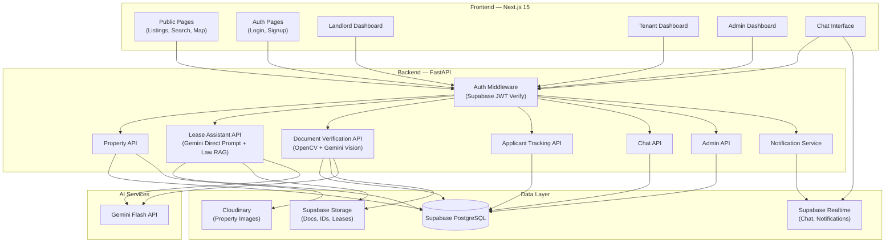
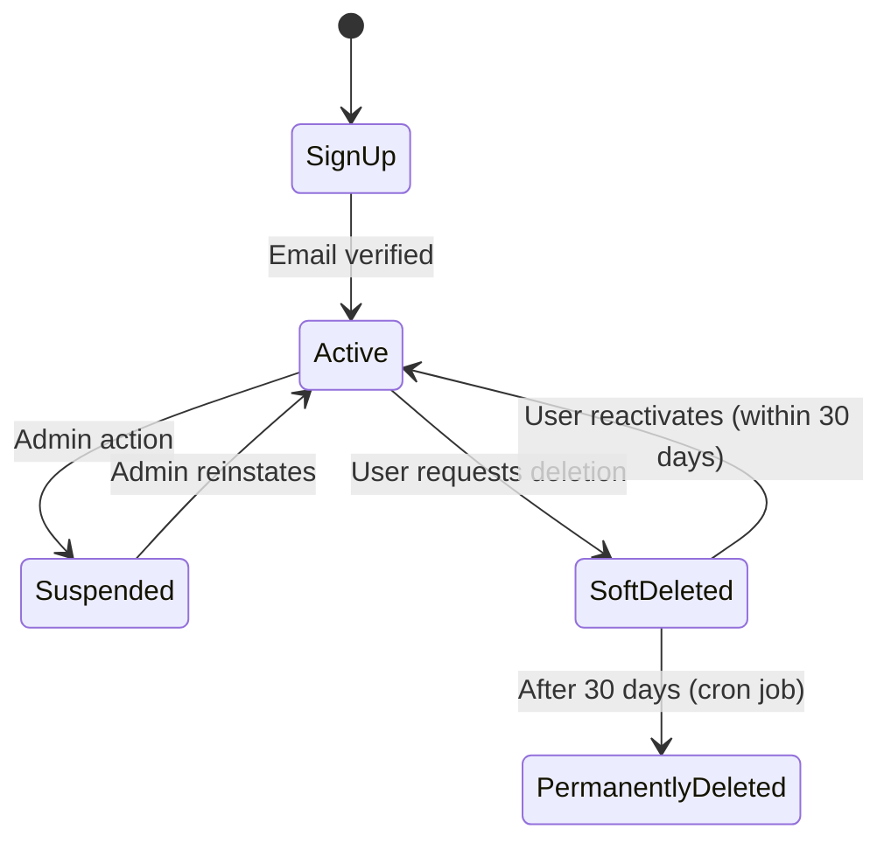
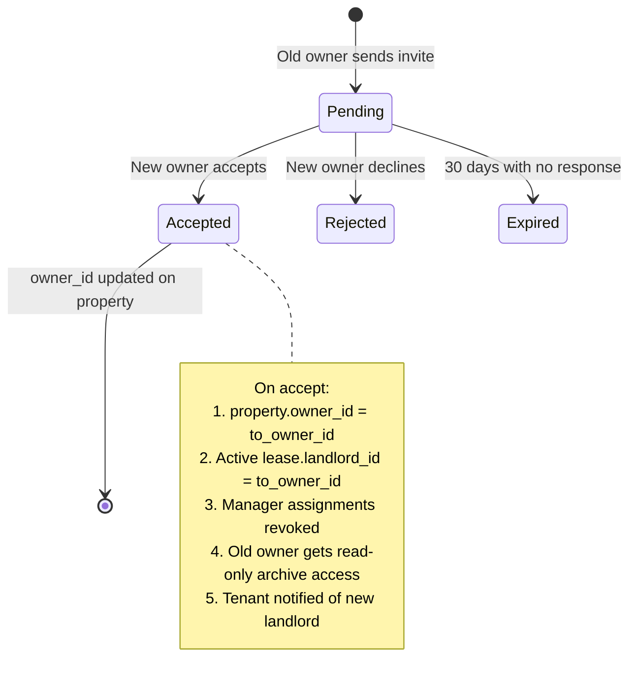
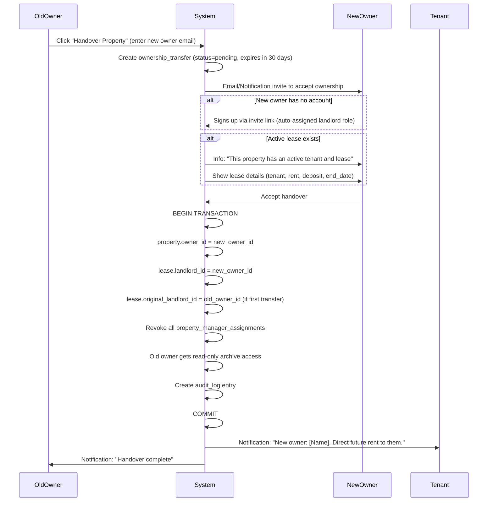

# System Design & Database Schema — Rental Management Platform

## Decisions Summary (From Q&A)

| Decision | Choice |
|---|---|
| Dual roles (Landlord + Tenant) | ✅ Same account can hold both |
| Co-ownership | ❌ Single owner per property (for now) |
| Multi-tenant per property | ❌ One tenant/group per property |
| Ownership transfer | Invite & Handover (old owner invites new owner via email, new accepts) |
| Mid-lease transfer | Lease auto-transfers to new owner |
| Payment tracking | Basic (paid/unpaid per month) |
| Admin panel | ✅ Full (moderation, user mgmt, orphaned properties) |
| Property manager | ✅ Configurable permissions per property |
| Account deletion | Soft delete → orphaned properties flagged for admin |
| Lease upload | Landlord uploads, both parties query |
| Maintenance vendor DB | ❌ **Module 4 removed entirely** |
| Geographic scope | All major Pakistani cities + sector/area |
| Property types | Residential only |
| Auth | Email + Password (Supabase Auth) |
| Notifications | In-app only (free) |
| Reviews | ✅ Tenants can review landlords/properties |
| File storage | Supabase Storage (docs/IDs) + Cloudinary (property images) |
| Maps | Leaflet.js + OpenStreetMap |
| Real-time chat | Supabase Realtime |
| AI | Gemini Flash (latest) |
| Admin RBAC | Simple role check (not granular RBAC) |
| Lease AI approach | Direct Gemini prompting (no chunking — leases are 2-5 pages) |
| Rental law compliance | Metadata-filtered RAG over provincial statutes (pgvector) |

---

## 1. Architecture Overview



> [!IMPORTANT]
> **FastAPI handles ALL business logic.** Next.js is a pure frontend — it calls FastAPI endpoints. Supabase is used for Auth, Database (Postgres), Storage, and Realtime only. No Supabase client-side queries for data mutations — everything goes through FastAPI to enforce business rules.

---

## 2. User & Role System

### Design

A user has a single `auth.users` entry (Supabase Auth). Their **roles** are stored in a `user_roles` table, allowing a user to be both a Landlord and a Tenant simultaneously.



### Edge Case: Account Soft Deletion

When a user requests deletion:
1. Account status → `soft_deleted`, `deleted_at` = now
2. All active listings → `delisted` (hidden from search)
3. Active leases → **NOT terminated** (remain valid, flagged for admin review)
4. Properties with active leases → `orphaned` status, admin notified
5. Properties with NO active leases → `delisted`
6. Chat remains accessible to the other party (read-only archive)
7. After 30 days: data anonymized, personal info purged, property records retained for legal compliance

---

## 3. Complete Database Schema

### 3.1 Core: Users & Roles

```sql
-- ============================================================
-- ENUM TYPES
-- ============================================================

CREATE TYPE user_status AS ENUM ('active', 'suspended', 'soft_deleted');
CREATE TYPE user_role AS ENUM ('admin', 'landlord', 'tenant');
CREATE TYPE property_status AS ENUM ('draft', 'active', 'occupied', 'delisted', 'orphaned');
CREATE TYPE property_type AS ENUM ('house', 'apartment', 'room', 'portion');
CREATE TYPE lease_status AS ENUM ('draft', 'active', 'expired', 'terminated', 'transferred');
CREATE TYPE payment_status AS ENUM ('paid', 'unpaid', 'overdue', 'waived');
CREATE TYPE transfer_status AS ENUM ('pending', 'accepted', 'rejected', 'expired');
CREATE TYPE application_status AS ENUM ('pending', 'under_review', 'accepted', 'rejected', 'withdrawn');
CREATE TYPE verification_status AS ENUM ('pending', 'verified', 'flagged', 'rejected');
CREATE TYPE document_type AS ENUM ('cnic_front', 'cnic_back', 'salary_slip', 'lease_agreement', 'notice', 'other');
CREATE TYPE notification_type AS ENUM (
    'ownership_transfer_request', 'ownership_transfer_accepted', 'ownership_transfer_rejected',
    'lease_created', 'lease_expiring', 'lease_terminated',
    'application_received', 'application_status_change',
    'payment_due', 'payment_overdue',
    'maintenance_request', 'chat_message',
    'document_verification_update', 'admin_notice',
    'review_received'
);
CREATE TYPE manager_permission AS ENUM (
    'manage_tenants', 'manage_listings', 'approve_maintenance',
    'chat_with_tenants', 'view_financials', 'manage_applications',
    'manage_documents'
);

-- ============================================================
-- 3.1 CORE: USERS & ROLES
-- ============================================================

-- Extends Supabase auth.users
CREATE TABLE profiles (
    id UUID PRIMARY KEY REFERENCES auth.users(id) ON DELETE CASCADE,
    full_name VARCHAR(255) NOT NULL,
    phone VARCHAR(20),
    cnic VARCHAR(15) UNIQUE, -- 13-digit Pakistani CNIC (stored without dashes)
    avatar_url TEXT,
    city VARCHAR(100),
    address TEXT,
    status user_status NOT NULL DEFAULT 'active',
    deleted_at TIMESTAMPTZ,
    created_at TIMESTAMPTZ NOT NULL DEFAULT NOW(),
    updated_at TIMESTAMPTZ NOT NULL DEFAULT NOW()
);

CREATE TABLE user_roles (
    id UUID PRIMARY KEY DEFAULT gen_random_uuid(),
    user_id UUID NOT NULL REFERENCES profiles(id) ON DELETE CASCADE,
    role user_role NOT NULL,
    granted_at TIMESTAMPTZ NOT NULL DEFAULT NOW(),
    granted_by UUID REFERENCES profiles(id), -- NULL = self-assigned at signup, else admin
    UNIQUE(user_id, role)
);

-- Index for fast role lookups
CREATE INDEX idx_user_roles_user_id ON user_roles(user_id);
CREATE INDEX idx_user_roles_role ON user_roles(role);
```

### 3.2 Properties

```sql
-- ============================================================
-- 3.2 PROPERTIES
-- ============================================================

CREATE TABLE cities (
    id SERIAL PRIMARY KEY,
    name VARCHAR(100) NOT NULL UNIQUE, -- 'Islamabad', 'Lahore', etc.
    province VARCHAR(100) NOT NULL
);

CREATE TABLE areas (
    id SERIAL PRIMARY KEY,
    city_id INT NOT NULL REFERENCES cities(id),
    name VARCHAR(100) NOT NULL, -- 'E-11', 'F-10', 'DHA Phase 5', etc.
    UNIQUE(city_id, name)
);

CREATE TABLE properties (
    id UUID PRIMARY KEY DEFAULT gen_random_uuid(),
    owner_id UUID NOT NULL REFERENCES profiles(id),
    title VARCHAR(255) NOT NULL,
    description TEXT,
    property_type property_type NOT NULL,
    status property_status NOT NULL DEFAULT 'draft',

    -- Location
    city_id INT NOT NULL REFERENCES cities(id),
    area_id INT NOT NULL REFERENCES areas(id),
    street_address TEXT,
    latitude DECIMAL(10, 8),
    longitude DECIMAL(11, 8),

    -- Details
    rent_amount DECIMAL(12, 2) NOT NULL, -- PKR
    security_deposit DECIMAL(12, 2) DEFAULT 0,
    bedrooms SMALLINT NOT NULL DEFAULT 0,
    bathrooms SMALLINT NOT NULL DEFAULT 0,
    area_sqft INT,
    is_furnished BOOLEAN DEFAULT FALSE,
    available_from DATE,

    -- Metadata
    created_at TIMESTAMPTZ NOT NULL DEFAULT NOW(),
    updated_at TIMESTAMPTZ NOT NULL DEFAULT NOW()
);

CREATE INDEX idx_properties_owner ON properties(owner_id);
CREATE INDEX idx_properties_status ON properties(status);
CREATE INDEX idx_properties_city_area ON properties(city_id, area_id);
CREATE INDEX idx_properties_rent ON properties(rent_amount);

-- Property images (stored on Cloudinary)
CREATE TABLE property_images (
    id UUID PRIMARY KEY DEFAULT gen_random_uuid(),
    property_id UUID NOT NULL REFERENCES properties(id) ON DELETE CASCADE,
    cloudinary_url TEXT NOT NULL,
    cloudinary_public_id VARCHAR(255) NOT NULL, -- for deletion
    is_cover BOOLEAN DEFAULT FALSE,
    display_order SMALLINT DEFAULT 0,
    created_at TIMESTAMPTZ NOT NULL DEFAULT NOW()
);

CREATE INDEX idx_property_images_property ON property_images(property_id);

-- Property amenities (flexible key-value)
CREATE TABLE property_amenities (
    id UUID PRIMARY KEY DEFAULT gen_random_uuid(),
    property_id UUID NOT NULL REFERENCES properties(id) ON DELETE CASCADE,
    amenity VARCHAR(100) NOT NULL, -- 'parking', 'generator', 'gas', 'internet', etc.
    UNIQUE(property_id, amenity)
);
```

### 3.3 Property Manager Delegation

```sql
-- ============================================================
-- 3.3 PROPERTY MANAGER DELEGATION
-- ============================================================

CREATE TABLE property_manager_assignments (
    id UUID PRIMARY KEY DEFAULT gen_random_uuid(),
    property_id UUID NOT NULL REFERENCES properties(id) ON DELETE CASCADE,
    manager_id UUID NOT NULL REFERENCES profiles(id),
    assigned_by UUID NOT NULL REFERENCES profiles(id), -- must be the owner

    is_active BOOLEAN NOT NULL DEFAULT TRUE,
    assigned_at TIMESTAMPTZ NOT NULL DEFAULT NOW(),
    revoked_at TIMESTAMPTZ,

    UNIQUE(property_id, manager_id) -- one assignment per manager per property
);

-- Permissions granted to a specific manager for a specific property
CREATE TABLE manager_permissions (
    id UUID PRIMARY KEY DEFAULT gen_random_uuid(),
    assignment_id UUID NOT NULL REFERENCES property_manager_assignments(id) ON DELETE CASCADE,
    permission manager_permission NOT NULL,
    UNIQUE(assignment_id, permission)
);

CREATE INDEX idx_pma_property ON property_manager_assignments(property_id);
CREATE INDEX idx_pma_manager ON property_manager_assignments(manager_id);
```

> [!NOTE]
> **Why a separate entity?** A property manager is NOT an owner. They cannot transfer ownership, delete the property, or modify the lease terms. Their access is scoped per-property and revocable at any time. Overloading `owner_id` would be a design flaw.

### 3.4 Ownership Handover (Invite & Accept)

```sql
-- ============================================================
-- 3.4 OWNERSHIP HANDOVER (Invite & Accept)
-- ============================================================

CREATE TABLE ownership_transfers (
    id UUID PRIMARY KEY DEFAULT gen_random_uuid(),
    property_id UUID NOT NULL REFERENCES properties(id),
    from_owner_id UUID NOT NULL REFERENCES profiles(id),
    to_owner_id UUID REFERENCES profiles(id), -- NULL until invitee accepts/signs up
    to_owner_email VARCHAR(255) NOT NULL, -- invitee email (may not have account yet)

    status transfer_status NOT NULL DEFAULT 'pending',

    -- Context
    reason TEXT, -- 'sale', 'inheritance', 'gift', etc.
    notes TEXT,
    handover_date DATE, -- effective date of ownership change
    attachment_url TEXT, -- optional scan of transfer letter / sale deed

    -- Timestamps
    initiated_at TIMESTAMPTZ NOT NULL DEFAULT NOW(),
    responded_at TIMESTAMPTZ,
    expires_at TIMESTAMPTZ DEFAULT (NOW() + INTERVAL '30 days') -- auto-expire if not accepted
);

CREATE INDEX idx_transfers_property ON ownership_transfers(property_id);
CREATE INDEX idx_transfers_status ON ownership_transfers(status);
CREATE INDEX idx_transfers_to_email ON ownership_transfers(to_owner_email);
```

> [!NOTE]
> **Why Invite & Handover instead of a dispute tribunal?** In Pakistan, real estate ownership transfers happen through registries, society transfer letters (DHA/CDA/Bahria), and sub-registrar offices — not inside a web app. This platform only needs to answer: "Who manages the listing now?" and "What happens to the active tenant?" A simple email invite + accept flow handles both questions cleanly without pretending to be a legal authority.

#### Ownership Handover State Machine



### 3.5 Leases & Payments

```sql
-- ============================================================
-- 3.5 LEASES & PAYMENTS
-- ============================================================

CREATE TABLE leases (
    id UUID PRIMARY KEY DEFAULT gen_random_uuid(),
    property_id UUID NOT NULL REFERENCES properties(id),
    landlord_id UUID NOT NULL REFERENCES profiles(id),
    tenant_id UUID NOT NULL REFERENCES profiles(id),

    status lease_status NOT NULL DEFAULT 'draft',

    -- Terms
    start_date DATE NOT NULL,
    end_date DATE NOT NULL,
    monthly_rent DECIMAL(12, 2) NOT NULL,
    security_deposit DECIMAL(12, 2) DEFAULT 0,
    payment_due_day SMALLINT DEFAULT 1, -- day of month rent is due (1-28)

    -- Lease document (stored in Supabase Storage)
    lease_pdf_url TEXT,
    lease_pdf_storage_path TEXT, -- Supabase Storage path for deletion

    -- Transfer tracking
    original_landlord_id UUID REFERENCES profiles(id), -- original landlord before any transfers
    transferred_at TIMESTAMPTZ,

    -- Termination
    terminated_by UUID REFERENCES profiles(id),
    termination_reason TEXT,

    created_at TIMESTAMPTZ NOT NULL DEFAULT NOW(),
    updated_at TIMESTAMPTZ NOT NULL DEFAULT NOW(),

    -- Business rules
    CONSTRAINT valid_date_range CHECK (end_date > start_date),
    CONSTRAINT valid_due_day CHECK (payment_due_day BETWEEN 1 AND 28)
);

CREATE INDEX idx_leases_property ON leases(property_id);
CREATE INDEX idx_leases_landlord ON leases(landlord_id);
CREATE INDEX idx_leases_tenant ON leases(tenant_id);
CREATE INDEX idx_leases_status ON leases(status);

-- Only one active lease per property at a time
CREATE UNIQUE INDEX idx_one_active_lease_per_property
    ON leases(property_id) WHERE status = 'active';

CREATE TABLE rent_payments (
    id UUID PRIMARY KEY DEFAULT gen_random_uuid(),
    lease_id UUID NOT NULL REFERENCES leases(id),
    
    period_month SMALLINT NOT NULL, -- 1-12
    period_year SMALLINT NOT NULL,
    amount DECIMAL(12, 2) NOT NULL,
    status payment_status NOT NULL DEFAULT 'unpaid',

    marked_paid_by UUID REFERENCES profiles(id), -- who marked it paid
    marked_paid_at TIMESTAMPTZ,
    receipt_url TEXT, -- optional receipt image (Supabase Storage)
    notes TEXT,

    created_at TIMESTAMPTZ NOT NULL DEFAULT NOW(),
    
    UNIQUE(lease_id, period_month, period_year)
);

CREATE INDEX idx_payments_lease ON rent_payments(lease_id);
CREATE INDEX idx_payments_status ON rent_payments(status);
```

### 3.6 Smart Lease Assistant (AI Context)

```sql
-- ============================================================
-- 3.6 SMART LEASE ASSISTANT
-- ============================================================

-- Stores full extracted text from lease PDFs (no chunking — leases are 2-5 pages)
-- Gemini's 1M+ token context window processes the entire text in a single prompt
CREATE TABLE lease_extracted_text (
    id UUID PRIMARY KEY DEFAULT gen_random_uuid(),
    lease_id UUID NOT NULL REFERENCES leases(id) ON DELETE CASCADE,
    full_text TEXT NOT NULL, -- complete extracted text from the PDF
    extraction_method VARCHAR(50) DEFAULT 'gemini_vision', -- 'gemini_vision', 'pymupdf', 'pdfplumber'
    page_count SMALLINT,
    extracted_at TIMESTAMPTZ NOT NULL DEFAULT NOW(),
    UNIQUE(lease_id)
);

-- Pakistani provincial rental law provisions (structured by legal section for metadata-filtered RAG)
CREATE TABLE rental_law_provisions (
    id SERIAL PRIMARY KEY,
    statute_id VARCHAR(50) NOT NULL, -- 'punjab_2009', 'sindh_1979', 'ict_2001', 'kpk_2014', 'balochistan_1959'
    province VARCHAR(100) NOT NULL, -- 'Punjab', 'Sindh', 'Islamabad', 'KPK', 'Balochistan'
    law_name VARCHAR(255) NOT NULL, -- 'Punjab Rented Premises Act 2009'
    section_number VARCHAR(100) NOT NULL, -- 'Section 15'
    title VARCHAR(255) NOT NULL, -- 'Grounds for Eviction'
    category VARCHAR(50) NOT NULL, -- 'eviction', 'rent_increase', 'security_deposit', 'notice_periods', etc.
    full_text TEXT NOT NULL, -- full text of the legal provision
    key_rules JSONB, -- extracted key rules as array of strings
    embedding VECTOR(768), -- Gemini text-embedding-004 for semantic search
    created_at TIMESTAMPTZ NOT NULL DEFAULT NOW()
);

CREATE INDEX idx_rlp_province ON rental_law_provisions(province);
CREATE INDEX idx_rlp_category ON rental_law_provisions(category);
CREATE INDEX idx_rlp_statute ON rental_law_provisions(statute_id);

-- Chat history for lease Q&A
CREATE TABLE lease_chat_messages (
    id UUID PRIMARY KEY DEFAULT gen_random_uuid(),
    lease_id UUID NOT NULL REFERENCES leases(id) ON DELETE CASCADE,
    user_id UUID NOT NULL REFERENCES profiles(id),
    role VARCHAR(10) NOT NULL CHECK (role IN ('user', 'assistant')),
    content TEXT NOT NULL,
    sources JSONB, -- references to relevant sections cited in the AI response
    created_at TIMESTAMPTZ NOT NULL DEFAULT NOW()
);

CREATE INDEX idx_lease_chat_lease ON lease_chat_messages(lease_id);
CREATE INDEX idx_lease_chat_user ON lease_chat_messages(user_id);

-- AI-generated lease summaries
CREATE TABLE lease_summaries (
    id UUID PRIMARY KEY DEFAULT gen_random_uuid(),
    lease_id UUID NOT NULL REFERENCES leases(id) ON DELETE CASCADE,
    summary_type VARCHAR(50) NOT NULL, -- 'critical_rules', 'full_summary', 'law_compliance'
    content JSONB NOT NULL, -- structured summary data
    generated_at TIMESTAMPTZ NOT NULL DEFAULT NOW(),
    model_used VARCHAR(50), -- 'gemini-flash-3.7' etc.
    UNIQUE(lease_id, summary_type)
);
```

> [!IMPORTANT]
> **pgvector extension** must be enabled in your Supabase project for the `VECTOR(768)` type used in `rental_law_provisions`. Go to Dashboard → Database → Extensions → Enable `vector`. Note: pgvector is used for the provincial rental law database (metadata-filtered RAG), **not** for lease text — lease Q&A uses direct Gemini prompting with the full extracted text.

### 3.7 Document Verification (Module 5)

```sql
-- ============================================================
-- 3.7 DOCUMENT VERIFICATION
-- ============================================================

CREATE TABLE tenant_documents (
    id UUID PRIMARY KEY DEFAULT gen_random_uuid(),
    tenant_id UUID NOT NULL REFERENCES profiles(id),
    property_id UUID REFERENCES properties(id), -- which property this verification is for
    document_type document_type NOT NULL,

    -- Storage
    storage_path TEXT NOT NULL, -- Supabase Storage path
    storage_url TEXT NOT NULL,

    -- Quality check results (OpenCV)
    quality_check_passed BOOLEAN,
    quality_issues JSONB, -- {'blur_score': 0.8, 'glare_detected': true, ...}

    -- OCR extraction results
    extracted_data JSONB, -- {'name': '...', 'cnic': '...', 'dob': '...'}
    extraction_confidence DECIMAL(5, 4), -- 0.0000 to 1.0000

    -- Cross-reference results
    cross_ref_result JSONB, -- {'name_match': 0.95, 'cnic_match': 1.0, 'dob_match': 0.88, ...}
    
    -- Final verdict
    verification_status verification_status NOT NULL DEFAULT 'pending',
    reviewed_by UUID REFERENCES profiles(id), -- landlord or admin who reviewed
    review_notes TEXT,

    created_at TIMESTAMPTZ NOT NULL DEFAULT NOW(),
    updated_at TIMESTAMPTZ NOT NULL DEFAULT NOW()
);

CREATE INDEX idx_tenant_docs_tenant ON tenant_documents(tenant_id);
CREATE INDEX idx_tenant_docs_property ON tenant_documents(property_id);
CREATE INDEX idx_tenant_docs_status ON tenant_documents(verification_status);
```

### 3.8 Real-Time Chat (Module 6)

```sql
-- ============================================================
-- 3.8 REAL-TIME CHAT
-- ============================================================

CREATE TABLE chat_rooms (
    id UUID PRIMARY KEY DEFAULT gen_random_uuid(),
    property_id UUID REFERENCES properties(id), -- NULL for admin chats
    
    -- Participants (exactly 2 for direct messaging)
    participant_1 UUID NOT NULL REFERENCES profiles(id),
    participant_2 UUID NOT NULL REFERENCES profiles(id),

    last_message_at TIMESTAMPTZ,
    created_at TIMESTAMPTZ NOT NULL DEFAULT NOW(),

    UNIQUE(property_id, participant_1, participant_2)
);

CREATE INDEX idx_chat_rooms_p1 ON chat_rooms(participant_1);
CREATE INDEX idx_chat_rooms_p2 ON chat_rooms(participant_2);

CREATE TABLE chat_messages (
    id UUID PRIMARY KEY DEFAULT gen_random_uuid(),
    room_id UUID NOT NULL REFERENCES chat_rooms(id) ON DELETE CASCADE,
    sender_id UUID NOT NULL REFERENCES profiles(id),
    
    content TEXT, -- text message (NULL if attachment-only)
    
    -- Attachment (optional)
    attachment_url TEXT,
    attachment_type VARCHAR(20), -- 'image', 'pdf', 'document'
    attachment_name VARCHAR(255),

    is_read BOOLEAN NOT NULL DEFAULT FALSE,
    created_at TIMESTAMPTZ NOT NULL DEFAULT NOW()
);

CREATE INDEX idx_chat_messages_room ON chat_messages(room_id);
CREATE INDEX idx_chat_messages_created ON chat_messages(created_at);
CREATE INDEX idx_chat_messages_unread ON chat_messages(room_id, is_read) WHERE NOT is_read;
```

### 3.9 Applicant Tracking (Module 7)

```sql
-- ============================================================
-- 3.9 APPLICANT TRACKING
-- ============================================================

CREATE TABLE applications (
    id UUID PRIMARY KEY DEFAULT gen_random_uuid(),
    property_id UUID NOT NULL REFERENCES properties(id),
    applicant_id UUID NOT NULL REFERENCES profiles(id), -- the tenant applying

    status application_status NOT NULL DEFAULT 'pending',

    -- Application data
    employer VARCHAR(255),
    occupation VARCHAR(255),
    monthly_income DECIMAL(12, 2),
    move_in_date DATE,
    num_occupants SMALLINT DEFAULT 1,
    has_pets BOOLEAN DEFAULT FALSE,
    additional_notes TEXT,

    -- References
    reference_name VARCHAR(255),
    reference_phone VARCHAR(20),
    reference_relation VARCHAR(100),

    -- Scoring
    match_score DECIMAL(5, 2), -- calculated rent-to-income ratio etc.
    score_breakdown JSONB, -- {'rent_to_income': 0.3, 'employment_stable': true, ...}

    -- Review
    reviewed_by UUID REFERENCES profiles(id), -- landlord
    review_notes TEXT,

    created_at TIMESTAMPTZ NOT NULL DEFAULT NOW(),
    updated_at TIMESTAMPTZ NOT NULL DEFAULT NOW(),

    -- One application per tenant per property
    UNIQUE(property_id, applicant_id)
);

CREATE INDEX idx_applications_property ON applications(property_id);
CREATE INDEX idx_applications_applicant ON applications(applicant_id);
CREATE INDEX idx_applications_status ON applications(status);
```

### 3.10 Reviews & Ratings

```sql
-- ============================================================
-- 3.10 REVIEWS & RATINGS
-- ============================================================

CREATE TABLE reviews (
    id UUID PRIMARY KEY DEFAULT gen_random_uuid(),
    property_id UUID NOT NULL REFERENCES properties(id),
    reviewer_id UUID NOT NULL REFERENCES profiles(id), -- tenant
    landlord_id UUID NOT NULL REFERENCES profiles(id), -- landlord being reviewed
    lease_id UUID REFERENCES leases(id), -- must have had a lease to review

    rating SMALLINT NOT NULL CHECK (rating BETWEEN 1 AND 5),
    comment TEXT,

    -- Moderation
    is_flagged BOOLEAN DEFAULT FALSE,
    flagged_reason TEXT,
    is_visible BOOLEAN DEFAULT TRUE, -- admin can hide

    created_at TIMESTAMPTZ NOT NULL DEFAULT NOW(),
    updated_at TIMESTAMPTZ NOT NULL DEFAULT NOW(),

    -- One review per tenant per lease
    UNIQUE(lease_id, reviewer_id)
);

CREATE INDEX idx_reviews_property ON reviews(property_id);
CREATE INDEX idx_reviews_landlord ON reviews(landlord_id);
```

### 3.11 Digital Compliance Vault (Module 8)

```sql
-- ============================================================
-- 3.11 DIGITAL COMPLIANCE VAULT
-- ============================================================

-- Legal notice templates (seeded by admin)
CREATE TABLE notice_templates (
    id UUID PRIMARY KEY DEFAULT gen_random_uuid(),
    title VARCHAR(255) NOT NULL,
    template_type VARCHAR(50) NOT NULL, -- 'notice_to_vacate', 'lease_renewal', 'rent_increase', etc.
    content_template TEXT NOT NULL, -- template with {{placeholders}}
    is_active BOOLEAN DEFAULT TRUE,
    created_by UUID REFERENCES profiles(id), -- admin
    created_at TIMESTAMPTZ NOT NULL DEFAULT NOW()
);

-- Generated/filled notices
CREATE TABLE generated_notices (
    id UUID PRIMARY KEY DEFAULT gen_random_uuid(),
    template_id UUID NOT NULL REFERENCES notice_templates(id),
    lease_id UUID REFERENCES leases(id),
    generated_by UUID NOT NULL REFERENCES profiles(id),
    filled_content TEXT NOT NULL,
    pdf_url TEXT, -- generated PDF stored in Supabase Storage
    sent_to UUID REFERENCES profiles(id),
    sent_at TIMESTAMPTZ,
    created_at TIMESTAMPTZ NOT NULL DEFAULT NOW()
);

-- Secure document storage (CNICs, salary slips, etc.)
CREATE TABLE secure_documents (
    id UUID PRIMARY KEY DEFAULT gen_random_uuid(),
    owner_id UUID NOT NULL REFERENCES profiles(id),
    lease_id UUID REFERENCES leases(id),
    document_type document_type NOT NULL,
    file_name VARCHAR(255) NOT NULL,
    storage_path TEXT NOT NULL, -- Supabase Storage (private bucket)
    storage_url TEXT NOT NULL,
    uploaded_at TIMESTAMPTZ NOT NULL DEFAULT NOW()
);

CREATE INDEX idx_secure_docs_owner ON secure_documents(owner_id);
CREATE INDEX idx_secure_docs_lease ON secure_documents(lease_id);

-- Compliance checklist
CREATE TABLE compliance_checklists (
    id UUID PRIMARY KEY DEFAULT gen_random_uuid(),
    lease_id UUID NOT NULL REFERENCES leases(id) ON DELETE CASCADE,
    
    -- Standard Pakistani rental compliance items
    stamp_paper_purchased BOOLEAN DEFAULT FALSE,
    agreement_registered BOOLEAN DEFAULT FALSE,
    police_verification_done BOOLEAN DEFAULT FALSE,
    security_deposit_received BOOLEAN DEFAULT FALSE,
    cnic_copies_exchanged BOOLEAN DEFAULT FALSE,
    utility_transfer_done BOOLEAN DEFAULT FALSE,

    -- Custom items
    custom_items JSONB DEFAULT '[]', -- [{"label": "...", "completed": false}]

    updated_at TIMESTAMPTZ NOT NULL DEFAULT NOW(),
    
    UNIQUE(lease_id)
);
```

### 3.12 Notifications

```sql
-- ============================================================
-- 3.12 IN-APP NOTIFICATIONS
-- ============================================================

CREATE TABLE notifications (
    id UUID PRIMARY KEY DEFAULT gen_random_uuid(),
    user_id UUID NOT NULL REFERENCES profiles(id) ON DELETE CASCADE,
    type notification_type NOT NULL,
    
    title VARCHAR(255) NOT NULL,
    body TEXT NOT NULL,
    
    -- Contextual links
    reference_id UUID, -- ID of the related entity (property, lease, application, etc.)
    reference_type VARCHAR(50), -- 'property', 'lease', 'application', 'transfer', etc.
    action_url TEXT, -- deep link path in the frontend

    is_read BOOLEAN NOT NULL DEFAULT FALSE,
    created_at TIMESTAMPTZ NOT NULL DEFAULT NOW()
);

CREATE INDEX idx_notifications_user ON notifications(user_id);
CREATE INDEX idx_notifications_unread ON notifications(user_id, is_read) WHERE NOT is_read;
CREATE INDEX idx_notifications_created ON notifications(created_at);
```

### 3.13 Audit Log (Critical for Disputes)

```sql
-- ============================================================
-- 3.13 AUDIT LOG
-- ============================================================

CREATE TABLE audit_log (
    id UUID PRIMARY KEY DEFAULT gen_random_uuid(),
    actor_id UUID REFERENCES profiles(id), -- NULL = system action
    action VARCHAR(100) NOT NULL, -- 'property.transfer', 'lease.create', 'account.delete', etc.
    entity_type VARCHAR(50) NOT NULL, -- 'property', 'lease', 'profile', etc.
    entity_id UUID NOT NULL,
    old_data JSONB, -- snapshot before change
    new_data JSONB, -- snapshot after change
    ip_address INET,
    created_at TIMESTAMPTZ NOT NULL DEFAULT NOW()
);

CREATE INDEX idx_audit_entity ON audit_log(entity_type, entity_id);
CREATE INDEX idx_audit_actor ON audit_log(actor_id);
CREATE INDEX idx_audit_action ON audit_log(action);
```

---

## 4. Edge Cases & How They're Handled

### 4.1 Ownership Handover with Active Lease



### 4.2 Tenant Moves Out → Property Vacant → Re-listing

| Step | Action | DB Change |
|------|--------|-----------| 
| 1 | Landlord or tenant ends lease | `lease.status` → `terminated` or `expired` |
| 2 | System auto-updates property | `property.status` → `active` (available for listing) |
| 3 | Landlord edits listing details if needed | Updates `properties` row |
| 4 | New tenants can browse and apply | `applications` table |
| 5 | Landlord accepts an applicant | `application.status` → `accepted` |
| 6 | Landlord creates new lease | New `leases` row, `property.status` → `occupied` |

### 4.3 Handover Edge Cases

| Scenario | Handling |
|----------|----------|
| New owner ignores invite | Transfer auto-expires after 30 days (`status` → `expired`). Old owner retains full control. |
| Old owner deletes account without handover | Property marked `orphaned`, admin notified. Admin can manually reassign `owner_id` upon proof of purchase (society transfer letter, registry docs). |
| Bogus handover attempt | Only the current `owner_id` can initiate — random users cannot claim ownership. New owner must explicitly accept. |
| Inheritance / death of owner | Admin creates handover on behalf of deceased (`reason = 'inheritance'`), enters heir's email. Heir accepts via invite. |

### 4.4 Owner Account Deletion (Soft Delete)

```
Owner requests deletion
├── Has active leases?
│   ├── YES → Properties marked 'orphaned', admin notified
│   │         Leases remain active (tenant protected)
│   │         Admin can assign new owner or terminate lease
│   └── NO → Properties marked 'delisted'
├── Profile status → 'soft_deleted'
├── deleted_at = NOW()
├── All listings hidden from search
├── Chat history preserved (read-only for other party)
└── 30-day window to reactivate
    ├── Reactivate → status='active', properties restored
    └── Expire → Data anonymized, audit log retained
```

### 4.5 Fake/Duplicate Ownership Claims

| Prevention Layer | Mechanism |
|---|---|
| **Database constraint** | `properties` table allows only one `owner_id` — cannot have conflicting claims |
| **Handover system** | Only the current `owner_id` can initiate a handover — random users cannot claim ownership |
| **Duplicate listing detection** | Before creating a listing, check for existing properties at the same `(city_id, area_id, street_address)` with fuzzy match |
| **Report system** | Any user can flag a listing as fraudulent → admin reviews |
| **Audit trail** | All ownership changes logged in `audit_log` — complete chain of custody |

### 4.6 Inheritance / Death of Owner

Handled as an admin-initiated handover (see also Section 4.3):
1. Legal heir contacts admin with proof (death certificate, succession certificate)
2. Admin creates a handover with `reason = 'inheritance'`, enters heir's email as `to_owner_email`
3. Heir receives invite email and accepts → ownership transfers
4. All active leases transfer automatically to the new owner

### 4.7 Property Manager Edge Cases

| Scenario | Handling |
|---|---|
| Owner deletes account | Manager assignments auto-revoked (orphaned property) |
| Manager's own account deleted | Assignment becomes inactive |
| Ownership transfers | **All manager assignments revoked** — new owner must reassign |
| Manager tries to transfer ownership | Blocked — only `owner_id` can initiate transfers |
| Manager tries to create lease | Allowed only if they have `manage_tenants` permission |

---

## 5. Row-Level Security (RLS) Policy Summary

> [!IMPORTANT]
> Since all mutations go through FastAPI (which uses a **service role key**), RLS is primarily for defense-in-depth and direct Supabase Realtime subscriptions. FastAPI enforces authorization in its own middleware.

| Table | Read Policy | Write Policy |
|---|---|---|
| `profiles` | Own profile: full. Others: name + avatar only | Own profile only |
| `properties` | Public if `status = 'active'`. Owner/tenant/manager: full | Owner or manager with `manage_listings` |
| `leases` | Landlord or tenant of the lease | Landlord only (create/update) |
| `rent_payments` | Landlord or tenant of the lease | Landlord (mark paid) |
| `chat_messages` | Participants of the room only | Sender only |
| `notifications` | Own notifications only | System only (via service role) |
| `tenant_documents` | Document owner + landlord of related property | Document owner (upload), landlord (review) |
| `applications` | Applicant (own) + landlord of property | Applicant (create), landlord (review) |
| `audit_log` | Admin only | System only |

---

## 6. Feasibility Assessment

### ✅ Fully Feasible

| Module | Notes |
|---|---|
| **M1: User & Role Management** | Standard Supabase Auth + custom profiles table. Straightforward. |
| **M2: Property Listing Manager** | CRUD + Cloudinary + Leaflet. Well-understood patterns. |
| **M3 FE1: Contract Q&A Chat** | Direct Gemini prompting with full lease text. No chunking needed — leases are 2-5 pages. |
| **M3 FE2: Rule Summarizer** | Single Gemini API call with structured output. Easy. |
| **M3 FE3: Legal Clause Highlighter** | Direct Gemini search over full lease text. Simple. |
| **M6: Real-Time Chat** | Supabase Realtime subscriptions. Well-documented. |
| **M7: Applicant Tracking** | Simple CRUD + formula-based scoring. Straightforward. |
| **M8: Compliance Vault** | Templates + file storage + checklist. Simple CRUD. |

### ⚠️ Feasible with Caveats

| Module | Concern | Recommendation |
|---|---|---|
| **M3 FE4: Lease vs Law** | Requires a curated knowledge base of Pakistani rental laws. Gemini alone may hallucinate legal advice. | Use metadata-filtered RAG: pre-filter `rental_law_provisions` by province, then vector search for relevant sections. Compare against full lease text. Always show disclaimer: "This is not legal advice." |
| **M5 FE1: Quality Checker (OpenCV)** | OpenCV runs in Python (FastAPI) — cannot run in the browser. Image must be uploaded first, then quality-checked server-side. | Upload → FastAPI checks quality → return pass/fail → if fail, prompt re-upload. This adds a round-trip but is the only way. |
| **M5 FE2: AI OCR (Gemini Vision)** | Gemini Vision is recommended over EasyOCR — faster, no server-side ML dependency, handles Urdu + English mixed text. | Send CNIC image directly to Gemini Vision API with extraction prompt. Return structured JSON. |
| **M5 FE3: Fuzzy Matching** | Works well for English names but Urdu/mixed-script names may have inconsistent transliterations. | Use `thefuzz` (Python) with a reasonable threshold (e.g., 85%). Flag for manual review below threshold rather than auto-rejecting. |

### ❌ Removed

| Module | Reason |
|---|---|
| **M4: Autonomous Maintenance Agent** | You confirmed this is not feasible. Removed from schema and plan. |

---

## 7. API Route Structure (FastAPI)

```
/api/v1/
├── auth/
│   ├── POST /signup
│   ├── POST /login
│   └── POST /logout
├── profiles/
│   ├── GET /me
│   ├── PATCH /me
│   └── GET /{user_id}  (public info only)
├── properties/
│   ├── GET /                (public listing with filters)
│   ├── POST /               (landlord creates)
│   ├── GET /{id}
│   ├── PATCH /{id}
│   ├── DELETE /{id}
│   ├── POST /{id}/images
│   └── DELETE /{id}/images/{image_id}
├── properties/{id}/managers/
│   ├── POST /               (assign manager)
│   ├── GET /                (list managers)
│   ├── PATCH /{assignment_id}  (update permissions)
│   └── DELETE /{assignment_id} (revoke)
├── transfers/
│   ├── POST /               (initiate handover — send invite email)
│   ├── POST /{id}/accept    (new owner accepts)
│   └── POST /{id}/reject    (new owner declines)
├── leases/
│   ├── POST /               (create lease)
│   ├── GET /{id}
│   ├── PATCH /{id}
│   ├── POST /{id}/terminate
│   ├── POST /{id}/upload-pdf
│   └── GET /{id}/payments
├── leases/{id}/ai/
│   ├── POST /chat           (direct-prompt Q&A)
│   ├── GET /summary         (rule summary)
│   ├── POST /search         (clause highlighter)
│   └── GET /compliance      (lease vs law — metadata-filtered RAG)
├── payments/
│   ├── PATCH /{id}/mark-paid
│   └── PATCH /{id}/mark-unpaid
├── applications/
│   ├── POST /               (tenant applies)
│   ├── GET /property/{id}   (landlord views applicants)
│   ├── PATCH /{id}/review   (landlord reviews)
│   └── GET /my              (tenant's applications)
├── documents/
│   ├── POST /upload         (tenant uploads)
│   ├── GET /{id}/status
│   ├── POST /{id}/verify    (trigger OCR + matching)
│   └── PATCH /{id}/review   (landlord reviews)
├── chat/
│   ├── GET /rooms           (my chat rooms)
│   ├── POST /rooms          (create/get room)
│   ├── GET /rooms/{id}/messages
│   └── POST /rooms/{id}/messages
├── notifications/
│   ├── GET /                (my notifications)
│   ├── PATCH /{id}/read
│   └── POST /mark-all-read
├── reviews/
│   ├── POST /               (tenant reviews)
│   ├── GET /property/{id}
│   └── GET /landlord/{id}
├── compliance/
│   ├── GET /templates
│   ├── POST /generate-notice
│   ├── GET /checklist/{lease_id}
│   └── PATCH /checklist/{lease_id}
└── admin/
    ├── GET /users
    ├── PATCH /users/{id}/suspend
    ├── PATCH /users/{id}/reinstate
    ├── GET /orphaned-properties
    ├── GET /flagged-reviews
    └── GET /audit-log
```

---

## 8. Supabase Realtime Channel Strategy

| Channel | Purpose | Subscribers |
|---|---|---|
| `chat:{room_id}` | Live chat messages | Both participants of the room |
| `notifications:{user_id}` | Real-time notification delivery | The user themselves |
| `property:{property_id}` | Property status updates (new application, lease change) | Owner + manager of that property |

---

## 9. File Storage Structure

### Supabase Storage Buckets

```
supabase-storage/
├── leases/          (private bucket)
│   └── {lease_id}/
│       └── contract.pdf
├── documents/       (private bucket)
│   └── {user_id}/
│       ├── cnic_front.jpg
│       ├── cnic_back.jpg
│       └── salary_slip.pdf
├── secure-vault/    (private bucket)
│   └── {user_id}/
│       └── {document_id}.pdf
├── chat-attachments/ (private bucket)
│   └── {room_id}/
│       └── {message_id}_filename.ext
└── notices/         (private bucket)
    └── {notice_id}.pdf
```

### Cloudinary (Public)

```
cloudinary/
└── properties/
    └── {property_id}/
        ├── cover.jpg
        ├── img_1.jpg
        ├── img_2.jpg
        └── ...
```
